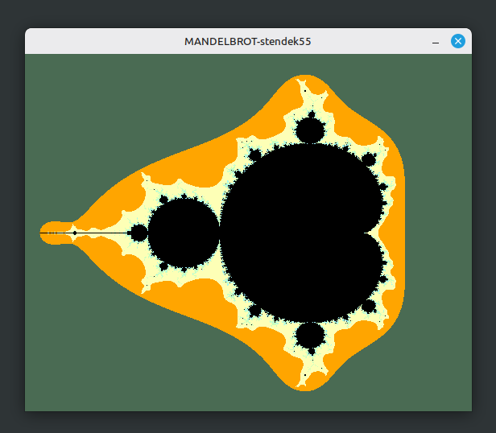

---
---
# ........ eigenständiges übungsprojekt ........
---
---

# Mandelbrot-Menge TDD

Ein interaktiver Visualisierer für die Mandelbrot-Menge, geschrieben in Rust. Dieses Projekt dient als persönliches Übungsprojekt, um komplexe mathematische Algorithmen, performante Framebuffer-Anzeige mittels Minifb und eine strikte Test-Driven Development (TDD) Methodik in Rust zu vertiefen.

## Kernmerkmale

* Eigenständiges Übungsprojekt zur Festigung fortgeschrittener Rust-Konzepte.
* Konsequent testgetriebene Entwicklung (TDD) für maximale Codequalität.
* Interaktives Konsolenmenü zur Auswahl vordefinierter, detailreicher Fraktal-Regionen.
* Pixelgenaues Rendering mit Minifb unter Verwendung einer kontraststarken Pastell-Farbpalette im Oldschool-Look.

## Die TDD-Vorgehensweise

Der gesamte mathematische Kern sowie die Rendering-Pipeline wurden strikt nach dem TDD-Prinzip (Red-Green-Refactor) aufgebaut. Keine Zeile Produktionscode wurde geschrieben, ohne dass zuvor ein fehlschlagender Unit-Test die Erwartungshaltung definiert hat. 

Die Test-Suite deckt folgende Kernkomponenten lückenlos ab:

1. Komplexe Arithmetik: Validierung der mathematischen Strukturen für komplexe Zahlen (Strukturerstellung, Addition, Quadrierung und die optimierte quadrierte Norm ohne rechenintensive Quadratwurzeln).
2. Koordinatenumrechnung: Verifizierung der linearen Skalierung zur fehlerfreien Transformation von zweidimensionalen Bildschirmpixeln in den komplexen Zahlenraum.
3. Escape-Zeit-Logik: Absicherung der Konvergenz- und Divergenzprüfungen für Punkte innerhalb der Menge (z.B. der stabile Nullpunkt oder oszillierende Randwerte) sowie außerhalb der Menge (sofortiges und sukzessives Entweichen).
4. Renderer-Integrität: Überprüfung der Dimensionen und der Speicherallokation des generierten Daten-Vektors.

## Projektaufbau

Das Projekt ist in eine Kernbibliothek und eine ausführbare Binärdatei unterteilt:

* src/lib.rs: Enthält die mathematischen Grundlagen, Datenstrukturen, Unit-Tests und die reine Berechnungslogik des Fraktals.
* src/main.rs: Steuert die CLI-Benutzereingabe, das Mapping der Fluchtzeiten auf die Oldschool-Farbpalette und die Verwaltung des Minifb-Fensters.

## Vordefinierten Regionen

Das Vorschaltmenü erlaubt den direkten Sprung in mathematisch koordinierte Ausschnitte:

* Ganzer Apfel (Hauptmenge)
* Seepferdchen-Tal
* Sonnensystem
* Dreifaches Spiral-Tal
* Elefanten-Tal
* Herz der Medusa
* Antennen-Tal
* Mini-Apfel (Satelliten-Menge)
* Sternen-Tal
* Doppelte Spirale
* Herz-Einkerbung

## Installation und Start

Voraussetzung ist eine installierte Rust-Toolchain.

1. Repository klonen oder in das Projektverzeichnis wechseln:
   cd mandelbrot-menge-tdd

2. Die TDD-Testsuite ausführen, um die Integrität des mathematischen Kerns zu überprüfen:
   cargo test

3. Die interaktive Anwendung starten:
   cargo run

## Bedienung

1. Nach dem Start in der Konsole die gewünschte Ziffer (0-10) eingeben und mit Enter bestätigen.
2. Das Minifb-Grafikfenster öffnet sich mit dem berechneten Ausschnitt.
3. Um das Grafikfenster zu schließen und zum Hauptmenü in der Konsole zurückzukehren, die Escape-Taste drücken.
4. Im Konsolenmenü 'q' eingeben, um das Programm vollständig zu beenden.

